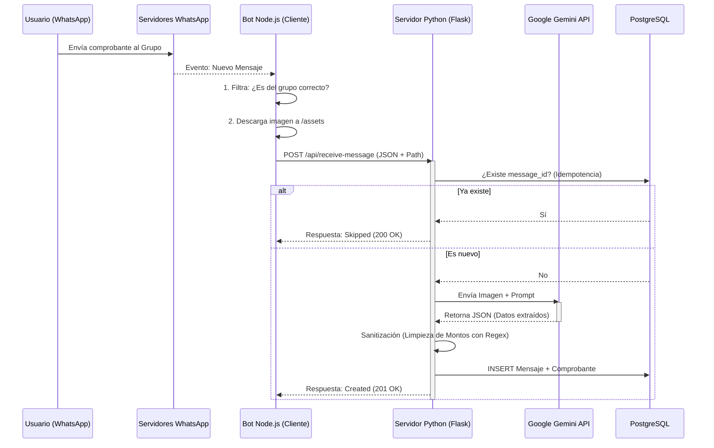

# Documentación Técnica: Sistema "Comprobantes Badie"

## 1. Diagrama de Flujo (Arquitectura)

Este diagrama representa cómo viaja la información desde que un usuario envía una imagen hasta que se guarda en la base de datos.

---

## 2. Apunte Teórico

### Nivel 1: Conceptos Básicos (Funcionalidad)
**¿Qué es este software?**
Es un sistema automatizado de **ETL (Extract, Transform, Load)** aplicado a comprobantes bancarios.
1.  **Extract (Extraer):** Escucha un grupo de WhatsApp y captura imágenes de transferencias.
2.  **Transform (Transformar):** Usa Inteligencia Artificial para "leer" la foto y convertirla en texto estructurado (quién envió, cuánto, cuándo).
3.  **Load (Cargar):** Guarda esa información ordenada en una base de datos y permite verla en una página web.

**Problema que resuelve:** Elimina la carga manual de datos. En lugar de copiar a mano montos y nombres de fotos de WhatsApp, el sistema lo hace solo al instante.

---

### Nivel 2: Conceptos Intermedios (Arquitectura de Software)

El sistema utiliza una **Arquitectura Híbrida de Microservicios**. En lugar de un solo programa gigante, tenemos dos especialistas trabajando juntos:

#### A. El "Oído" (Node.js + whatsapp-web.js)
Elegimos Node.js porque JavaScript es el lenguaje nativo de la web y maneja excelentemente eventos asíncronos.
*   **Rol:** Cliente de WhatsApp.
*   **Librería:** `whatsapp-web.js` simula un navegador real usando Puppeteer (un Chrome invisible) para conectarse a WhatsApp Web.
*   **Sincronización:** Capacidad de leer mensajes en tiempo real y también "viajar al pasado" para recuperar mensajes antiguos (Sync Histórico).

#### B. El "Cerebro" (Python + Flask + SQLAlchemy)
Elegimos Python por su dominio en procesamiento de datos e IA.
*   **Rol:** Servidor API y Procesador Lógico.
*   **Flask:** Expone un endpoint (`/api/receive-message`) que actúa como puerta de entrada.
*   **Gemini Flash 2.5:** El modelo de IA utilizado. Es "multimodal", lo que significa que puede entender texto e imágenes simultáneamente.

---

### Nivel 3: Conceptos Avanzados (Ingeniería de Software)

#### 1. Idempotencia
Este es el concepto más crítico implementado.
*   **Definición:** La propiedad de realizar una acción múltiples veces y obtener el mismo resultado que si se hiciera una sola vez.
*   **Implementación:** El Bot de Node.js puede enviar el mismo mensaje 10 veces (por error de red o reinicio), pero Python verifica el `message_id` único en la base de datos antes de procesar. Si ya existe, lo descarta. Esto evita duplicar dinero en la contabilidad.

#### 2. Sanitización de Datos y Regex
Las IAs son **no deterministas**; pueden devolver "$1.000", "1000 ARS" o "mil pesos". Las bases de datos requieren precisión rígida.
*   **Solución:** Implementamos una capa de limpieza con **Expresiones Regulares (Regex)** antes de guardar.
*   **Lógica:** `re.sub(r'[^\d.,\-]', '', s)` elimina todo lo que no sea número, punto o coma. Luego, un algoritmo heurístico detecta si la coma es decimal (Argentina) o separador de miles (USA) para estandarizar todo a formato flotante puro.

#### 3. ORM (Object-Relational Mapping)
No escribimos SQL puro (`INSERT INTO...`). Usamos **SQLAlchemy**.
*   **Ventaja:** Tratamos las filas de la base de datos como objetos de Python (`Comprobante`, `Mensaje`). Esto previene inyecciones SQL y facilita el mantenimiento si cambiamos de motor de base de datos en el futuro.

#### 4. Relaciones One-to-Many (1:N)
Modelamos la realidad de los datos:
*   Un `Mensaje` de WhatsApp contiene la "metadata" del envío (ID, remitente, hora).
*   Un `Comprobante` contiene la "data financiera" (monto, banco).
*   Están separados pero vinculados por una **Foreign Key**. Esto permite que, si en el futuro un mensaje tiene 2 fotos, el sistema pueda escalar sin romperse.
