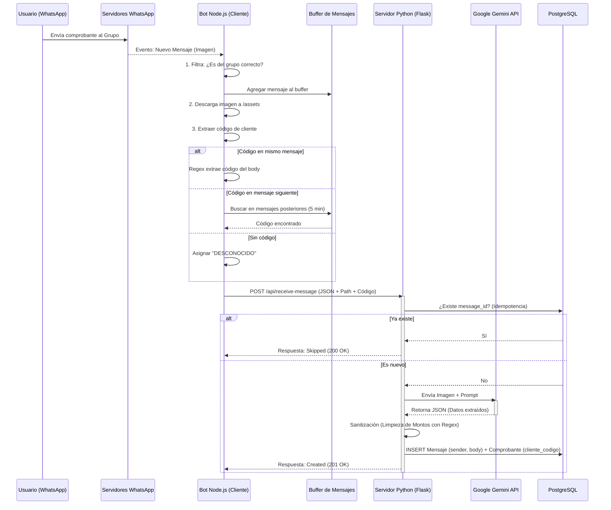
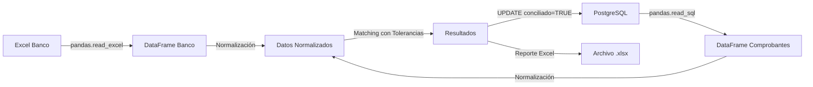

# Documentación Técnica: Sistema "Bank Reconciliation ARG"

## 1. Diagrama de Flujo (Arquitectura)

Este diagrama representa cómo viaja la información desde que un usuario envía una imagen hasta que se guarda en la base de datos.



---

## 2. Apunte Teórico

### Nivel 1: Conceptos Básicos (Funcionalidad)
**¿Qué es este software?**
Es un sistema automatizado de **ETL (Extract, Transform, Load)** aplicado a comprobantes bancarios.
1.  **Extract (Extraer):** Escucha un grupo de WhatsApp y captura imágenes de transferencias.
2.  **Transform (Transformar):** Usa Inteligencia Artificial para "leer" la foto y convertirla en texto estructurado (quién envió, cuánto, cuándo).
3.  **Load (Cargar):** Guarda esa información ordenada en una base de datos y permite verla en una página web.

**Problema que resuelve:** Elimina la carga manual de datos. En lugar de copiar a mano montos y nombres de fotos de WhatsApp, el sistema lo hace solo al instante.

---

### Nivel 2: Conceptos Intermedios (Arquitectura de Software)

El sistema utiliza una **Arquitectura Híbrida de Microservicios**. En lugar de un solo programa gigante, tenemos dos especialistas trabajando juntos:

#### A. El "Oído" (Node.js + whatsapp-web.js)
Elegimos Node.js porque JavaScript es el lenguaje nativo de la web y maneja excelentemente eventos asíncronos.
*   **Rol:** Cliente de WhatsApp.
*   **Librería:** `whatsapp-web.js` simula un navegador real usando Puppeteer (un Chrome invisible) para conectarse a WhatsApp Web.
*   **Sincronización:** Capacidad de leer mensajes en tiempo real y también "viajar al pasado" para recuperar mensajes antiguos (Sync Histórico).

#### B. El "Cerebro" (Python + Flask + SQLAlchemy)
Elegimos Python por su dominio en procesamiento de datos e IA.
*   **Rol:** Servidor API y Procesador Lógico.
*   **Flask:** Expone un endpoint (`/api/receive-message`) que actúa como puerta de entrada.
*   **Gemini Flash 2.5:** El modelo de IA utilizado. Es "multimodal", lo que significa que puede entender texto e imágenes simultáneamente.

---

### Nivel 3: Conceptos Avanzados (Ingeniería de Software)

#### 1. Idempotencia
Este es el concepto más crítico implementado.
*   **Definición:** La propiedad de realizar una acción múltiples veces y obtener el mismo resultado que si se hiciera una sola vez.
*   **Implementación:** El Bot de Node.js puede enviar el mismo mensaje 10 veces (por error de red o reinicio), pero Python verifica el `message_id` único en la base de datos antes de procesar. Si ya existe, lo descarta. Esto evita duplicar dinero en la contabilidad.

#### 2. Sanitización de Datos y Regex
Las IAs son **no deterministas**; pueden devolver "$1.000", "1000 ARS" o "mil pesos". Las bases de datos requieren precisión rígida.
*   **Solución:** Implementamos una capa de limpieza con **Expresiones Regulares (Regex)** antes de guardar.
*   **Lógica:** `re.sub(r'[^\d.,\-]', '', s)` elimina todo lo que no sea número, punto o coma. Luego, un algoritmo heurístico detecta si la coma es decimal (Argentina) o separador de miles (USA) para estandarizar todo a formato flotante puro.

#### 3. ORM (Object-Relational Mapping)
No escribimos SQL puro (`INSERT INTO...`). Usamos **SQLAlchemy**.
*   **Ventaja:** Tratamos las filas de la base de datos como objetos de Python (`Comprobante`, `Mensaje`). Esto previene inyecciones SQL y facilita el mantenimiento si cambiamos de motor de base de datos en el futuro.

#### 4. Relaciones One-to-Many (1:N)
Modelamos la realidad de los datos:
*   Un `Mensaje` de WhatsApp contiene la "metadata" del envío (ID, remitente, hora, texto).
*   Un `Comprobante` contiene la "data financiera" (monto, banco, código de cliente).
*   Están separados pero vinculados por una **Foreign Key**. Esto permite que, si en el futuro un mensaje tiene 2 fotos, el sistema pueda escalar sin romperse.

#### 5. Sistema de Espera de Imágenes y Asociación de Códigos
Sistema de captura inteligente de códigos de cliente:
*   **Problema:** Los usuarios envían el código de cliente en el mismo mensaje de la imagen O en un mensaje posterior (hasta 1 minuto después).
*   **Solución en Tiempo Real:** Implementamos un **Map en memoria** que almacena UNA imagen por autor esperando código:
    - **Clave:** ID del remitente (número de WhatsApp)
    - **Valor:** Objeto con datos de la imagen y un timer de 1 minuto
*   **Comportamiento de reemplazo:** Si un autor envía otra imagen antes de proporcionar el código, la imagen anterior se procesa como "DESCONOCIDO" y se reemplaza por la nueva.
*   **Extracción de código:** Regex `/\d+/g` busca secuencias numéricas en el texto. Toma el primer número encontrado como código de cliente.
*   **Estrategia de búsqueda:**
    1. Intentar extraer del `body` del mensaje con imagen
    2. Si falla en tiempo real: Esperar 1 minuto por mensaje siguiente del mismo autor
    3. Si falla en histórico: Buscar hacia atrás (mismo timestamp) y hacia adelante (60 segundos) usando mensajes ya ordenados
    4. Si no encuentra, asignar "DESCONOCIDO"
*   **Sistema de "usado":** En modo histórico, los mensajes de texto se marcan como "usados" para evitar reutilización con múltiples imágenes.
*   **Ventaja:** Sistema simple que maneja tanto tiempo real como sincronización histórica sin necesidad de almacenamiento persistente.

#### 6. Migración de Base de Datos
Para agregar nuevas columnas a una base de datos en producción sin perder datos:
*   **Script idempotente:** `migrate_cliente_codigo.py` verifica si las columnas existen antes de crearlas.
*   **Uso de `inspect`:** SQLAlchemy permite introspección de esquemas sin queries SQL crudos.
*   **Transacciones seguras:** Si falla la migración, se ejecuta `rollback()` automático.
*   **Valores por defecto:** Los registros existentes reciben "DESCONOCIDO" como código inicial.

#### 7. Conciliación Bancaria
Sistema automatizado de cruce entre comprobantes procesados y registros del banco:
*   **Problema:** Verificar que los comprobantes de WhatsApp coincidan con los movimientos reales del banco.
*   **Solución:** Módulo `bank_reconciliation.py` que cruza datos usando tres claves: Fecha + CUIT + Monto.
*   **Enfoque con pandas:** Preferimos procesamiento en memoria sobre SQL puro para mayor flexibilidad en el matching.
*   **Ventajas del enfoque:**
    - **Tolerancia en matching:** Permite diferencias de ±1 día en fechas y centavos en montos
    - **Normalización flexible:** Maneja múltiples formatos de fecha, CUIT y montos
    - **Reportes ricos:** Genera Excel con múltiples hojas (conciliados, faltantes, duplicados)
*   **Configuración dinámica:** Archivo `bank_config.json` permite mapear columnas sin modificar código.
*   **Actualización dual:** Marca registros en BD (columna `conciliado`) y genera reporte de auditoría.

---

## 3. Módulo de Conciliación Bancaria

### 3.1. Descripción General
El módulo de conciliación bancaria (`src/bank_reconciliation.py`) permite cruzar automáticamente los comprobantes procesados desde WhatsApp con los registros bancarios exportados en Excel.

### 3.2. Arquitectura de Datos

#### Modelo de Datos (Extensión)
Se agregaron tres nuevas columnas a la tabla `comprobantes`:

```sql
conciliado                  BOOLEAN DEFAULT FALSE
fecha_conciliacion          TIMESTAMP
observaciones_conciliacion  VARCHAR
```

#### Flujo de Datos



### 3.3. Proceso de Conciliación

#### Paso 1: Normalización de Datos

**CUITs/CUILs:**
```python
# Entrada: "20-12345678-9" o "20.123.456.789"
# Salida: "20123456789"
```

**Montos:**
```python
# Formato AR: "1.000,50" → 1000.50
# Formato US: "1,000.50" → 1000.50
# Sin símbolo: "$1500" → 1500.00
```

**Fechas:**
```python
# Soporta: "31/12/2024", "2024-12-31", "31-12-2024"
# Convierte todo a: datetime.datetime(2024, 12, 31)
```

#### Paso 2: Matching con Tolerancias

El algoritmo busca coincidencias usando tres claves con tolerancias configurables:

1. **CUIT:** Coincidencia exacta (después de normalización)
   - Compara contra `remitente_id` O `destinatario_id`

2. **Fecha:** Tolerancia configurable (default: ±1 día)
   ```python
   fecha_diff = abs((fecha_comp - fecha_banco).days)
   fecha_match = fecha_diff <= tolerancia_dias
   ```

3. **Monto:** Tolerancia configurable (default: ±0.01)
   ```python
   monto_diff = abs(monto_comp - monto_banco)
   monto_match = monto_diff <= tolerancia_monto
   ```

**Criterio de Match:** Las tres condiciones deben cumplirse simultáneamente.

#### Paso 3: Clasificación de Resultados

Los registros se clasifican en tres categorías:

1. **Conciliados:** Comprobantes que matchean con el banco
   - Se marcan con `conciliado = TRUE` en la BD
   - Se registra `fecha_conciliacion = NOW()`

2. **Faltantes en BD:** Movimientos del banco sin comprobante
   - Pueden indicar transferencias no reportadas en WhatsApp
   - Requieren investigación manual

3. **Faltantes en Banco:** Comprobantes sin registro bancario
   - Pueden indicar imágenes duplicadas o transferencias pendientes
   - Requieren revisión

### 3.4. Configuración (`bank_config.json`)

```json
{
  "column_mapping": {
    "fecha": "Fecha",           // Nombre de columna en Excel del banco
    "cuit": "CUIT",             // Nombre de columna con CUIT
    "monto": "Importe"          // Nombre de columna con monto
  },
  "tolerances": {
    "fecha_dias": 1,            // ±N días de tolerancia
    "monto_diferencia": 0.01    // ±N pesos de tolerancia
  },
  "data_formats": {
    "fecha_format": "%d/%m/%Y",           // Formato de fecha en Excel
    "monto_decimal_separator": ",",       // Separador decimal (AR: ,)
    "monto_thousands_separator": ".",     // Separador de miles (AR: .)
    "cuit_format": "with_dashes"          // Formato CUIT en Excel
  },
  "excel_options": {
    "sheet_name": 0,            // Índice o nombre de hoja
    "header_row": 0,            // Fila con encabezados (0-indexed)
    "skip_rows": 0              // Filas a saltar antes de header
  }
}
```

### 3.5. Uso del Módulo

#### Migración de Base de Datos

Antes de usar por primera vez, ejecutar la migración:

```bash
python migrate_conciliacion.py
```

Esto agrega las columnas `conciliado`, `fecha_conciliacion` y `observaciones_conciliacion`.

#### Configurar Mapeo de Columnas

1. Abrir el Excel del banco y verificar nombres exactos de columnas
2. Editar `bank_config.json` con los nombres correctos:
   ```json
   "column_mapping": {
     "fecha": "Fecha Operación",    // Nombre exacto en tu Excel
     "cuit": "CUIL/CUIT Cliente",   // Nombre exacto en tu Excel
     "monto": "Monto $"             // Nombre exacto en tu Excel
   }
   ```

#### Ejecutar Conciliación

**Desde línea de comandos:**
```bash
# Usando configuración por defecto (bank_config.json)
python main.py reconcile -e assets/banco/movimientos_enero.xlsx

# Con configuración personalizada
python main.py reconcile -e assets/banco/movimientos_enero.xlsx -c mi_config.json

# Especificando ruta de reporte
python main.py reconcile -e assets/banco/movimientos_enero.xlsx -o reportes/conciliacion_enero.xlsx
```

**Desde menú interactivo:**
```bash
python main.py
# Seleccionar opción 5 (Reconcile)
# Ingresar ruta al Excel cuando se solicite
```

### 3.6. Interpretación del Reporte

El reporte Excel generado contiene tres hojas:

#### Hoja 1: "Conciliados"
Registros que coinciden entre BD y banco.

| Columna | Descripción |
|---------|-------------|
| ID Comprobante | ID interno del comprobante en BD |
| Cliente Código | Código del cliente asignado |
| Banco | Entidad bancaria detectada |
| Fecha Comprobante | Fecha extraída de la imagen |
| Fecha Banco | Fecha del registro bancario |
| Diferencia Días | Días de diferencia (0 = exacto) |
| Monto Comprobante | Monto extraído de la imagen |
| Monto Banco | Monto del registro bancario |
| Diferencia Monto | Diferencia en pesos |
| Imagen | Ruta al archivo de imagen |

#### Hoja 2: "Faltantes en BD"
Movimientos del banco que NO tienen comprobante en WhatsApp.

**Posibles causas:**
- Transferencia no reportada por el cliente
- Comprobante perdido/no enviado
- Error en el CUIT del comprobante
- Imagen de mala calidad que no se procesó

#### Hoja 3: "Faltantes en Banco"
Comprobantes de WhatsApp que NO aparecen en el banco.

**Posibles causas:**
- Imagen duplicada o reenviada
- Comprobante falso/editado
- Transferencia pendiente de acreditación
- Error en los datos del banco (CUIT incorrecto)
- Diferencia de fechas mayor a la tolerancia

### 3.7. Casos Especiales

#### Múltiples Matches (Ambigüedad)
El algoritmo asigna **un comprobante a un solo registro bancario** (first-match). Si hay múltiples candidatos, toma el primero encontrado.

**Mejora futura:** Detectar y reportar casos ambiguos en una cuarta hoja del reporte.

#### CUITs en Diferentes Roles
El algoritmo compara el CUIT del banco contra:
- `remitente_id` (el que envía el dinero)
- `destinatario_id` (el que recibe el dinero)

Esto permite matchear transferencias independientemente del sentido del flujo.

#### Tolerancia en Fechas
Útil porque:
- El banco puede registrar la transferencia al día siguiente
- Diferencias horarias (envío 23:55 → acreditación 00:05 del día siguiente)
- Feriados bancarios

**Recomendación:** Comenzar con `fecha_dias: 1` y ajustar según necesidad.

### 3.8. Consideraciones de Performance

**Complejidad algorítmica:**
- Worst case: O(n × m) donde n = registros banco, m = comprobantes
- Con 1000 registros bancarios y 500 comprobantes: ~500,000 comparaciones
- Tiempo estimado: < 5 segundos en hardware moderno

**Optimizaciones implementadas:**
- Early exit al encontrar match (evita comparaciones redundantes)
- Normalización única por registro (no se repite en cada comparación)
- Uso de sets para tracking de matched (O(1) lookup)

**Límites prácticos:**
- pandas maneja cómodamente datasets de hasta 100,000 registros en memoria
- Para volúmenes superiores, considerar migrar a approach SQL con índices

### 3.9. Troubleshooting

#### Error: "Columnas faltantes en el Excel"
```
Solución: Verificar nombres exactos en bank_config.json
El nombre debe coincidir EXACTAMENTE (incluyendo mayúsculas y espacios)
```

#### Problema: Ningún registro conciliado
```
Causas posibles:
1. Formato de fecha incorrecto en data_formats
2. CUITs con diferente formato (con/sin guiones)
3. Montos con separadores diferentes
4. Tolerancias muy estrictas

Solución: Revisar configuración en bank_config.json
```

#### Problema: Demasiados "Faltantes en BD"
```
Posibles causas:
1. El Excel del banco contiene TODO el mes, pero solo procesaste 1 semana de WhatsApp
2. Muchas transferencias no se reportaron en el grupo

Solución: Filtrar el Excel del banco por rango de fechas antes de conciliar
```
